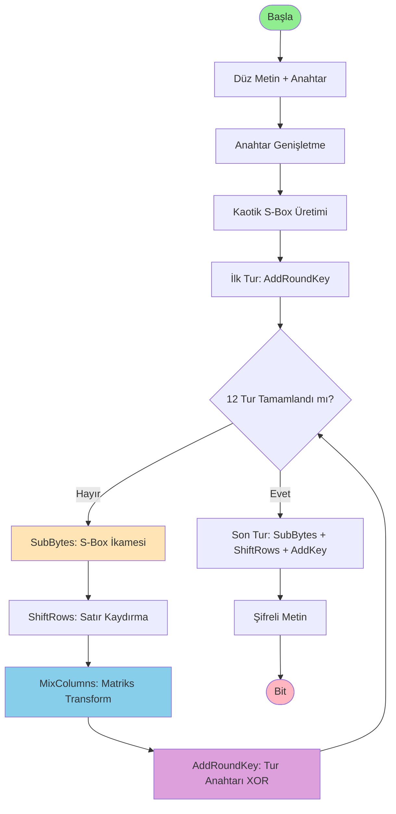

# Chaos-Mix Encryption (CME) - Kriptografik Algoritma Tasarımı

**Proje:** Kriptografik Algoritma Geliştirme ve Analizi  
**Tasarımcı:** Samet YEŞİLOT  
**Tarih:** 30 Aralık 2024  
**Aşama:** 1 - Algoritma Tasarımı ve Şartname

---

## 📋 Algoritma Özellikleri

| Özellik | Değer |
|---------|-------|
| **Algoritma Adı** | Chaos-Mix Encryption (CME) |
| **Tip** | Blok Şifre |
| **Anahtar Boyutu** | 256-bit (32 byte) |
| **Blok Boyutu** | 128-bit (16 byte) |
| **Tur Sayısı** | 12 tur |
| **Mod** | CBC (Cipher Block Chaining) |

---

## 🎯 Gerekçe ve Felsefe

### Tasarım Odağı

Chaos-Mix Encryption, **kaos teorisi** ve **modern blok şifreleme** tekniklerini birleştirerek özgün bir kriptografik yapı oluşturur. Algoritma, aşağıdaki tehditlere karşı dayanıklı olacak şekilde tasarlanmıştır:

#### Hedeflenen Saldırı Türleri

1. **Frekans Analizi Saldırıları**
   - Dinamik S-Box kullanımıyla her şifreleme farklı ikame tablosu üretir
   - Kaotik harita sayesinde deterministik olmayan dönüşümler

2. **Diferansiyel Kriptanaliz**
   - MixColumns benzeri matriks transformasyonu ile yüksek yayılma (diffusion)
   - Tek bit değişikliği tüm bloğu etkiler (çığ etkisi)

3. **Lineer Kriptanaliz**
   - Modüler aritmetik ve XOR operasyonlarının kombinasyonu
   - Lineer olmayan S-Box yapısı

4. **Brute Force Saldırıları**
   - 256-bit anahtar uzayı (2^256 kombinasyon)
   - Hesaplama karmaşıklığı: O(2^256)

### Tasarım Felsefesi

> "Kaos içinden düzen, düzen içinden güvenlik"

Algoritma, **Logistic Map** gibi kaotik sistemlerin hassas başlangıç koşullarına bağımlılığını (butterfly effect) kriptografik güvenlik için kullanır. Bu sayede:

- **Küçük anahtar değişiklikleri** → **Tamamen farklı şifremetinler**
- **Deterministik ama tahmin edilemez** davranış
- **Matemat

iksel derinlik** ile güvenlik

---

## 🔧 Kriptografik Prensipler

### 1. İkame (Substitution)

**Kaotik S-Box Üretimi:**

Logistic Map kullanılarak dinamik S-Box oluşturulur:

```
x(n+1) = r × x(n) × (1 - x(n))
```

**Parametreler:**
- `r = 3.9` (kaotik bölge)
- `x(0)` = Anahtardan türetilen seed değeri

Her byte için 0-255 arası benzersiz değerler içeren S-Box üretilir.

### 2. Permütasyon

**4×4 Matriks Transformasyonu:**

AES'in MixColumns'una benzer ama farklı katsayılarla GF(2^8) üzerinde işlem:

```
[b0']   [02 03 01 01]   [b0]
[b1'] = [01 02 03 01] × [b1]
[b2']   [01 01 02 03]   [b2]
[b3']   [03 01 01 02]   [b3]
```

### 3. Modüler Aritmetik

**GF(2^8) Çarpımı:**

İndirgenemez polinom: `P(x) = x^8 + x^4 + x^3 + x + 1`

Her byte işlemi bu galois field üzerinde gerçekleştirilir.

---

## 📊 Algoritma Akış Şeması



---

## 📐 Matematiksel Fonksiyonlar

### 1. Anahtar Genişletme (Key Expansion)

**Fonksiyon:** `KeyExpand(K) → K₀, K₁, ..., K₁₂`

**Girdi:** 256-bit ana anahtar `K`  
**Çıktı:** 13 adet 128-bit tur anahtarı

**Matematiksel İfade:**

```
K₀ = K[0:127]  # İlk 128 bit
K₁ = K[128:255]  # Son 128 bit

For i = 2 to 12:
    temp = RotWord(K_{i-1}[96:127])
    temp = SubWord(temp, S-Box)
    temp = temp ⊕ RCon[i]
    K_i = K_{i-2} ⊕ temp
```

**Round Constants (RCon):**
```
RCon[i] = [x^(i-1), 0, 0, 0] mod P(x)
P(x) = x^8 + x^4 + x^3 + x + 1
```

---

### 2. Kaotik S-Box Üretimi

**Fonksiyon:** `GenerateSBox(seed) → S[256]`

**Logistic Map:**

```
x₀ = seed / 2^256  # Normalize to [0, 1]
r = 3.9

For n = 0 to 2559:
    x_{n+1} = r × xₙ × (1 - xₙ)
    
    if n ≥ 2304:  # Skip transient
        idx = n - 2304
        S[idx] = floor(x_{n+1} × 256)
```

**Benzersizlik Kontrolü:**

Fisher-Yates shuffle uygulanarak tüm değerlerin 0-255 aralığında benzersiz olması sağlanır.

---

### 3. SubBytes Transformasyonu

**Fonksiyon:** `SubBytes(State) → State'`

**Matematiksel İfade:**

```
For i = 0 to 15:
    State'[i] = S-Box[State[i]]
```

Her byte, kaotik S-Box tablosundan alınan değerle değiştirilir.

---

### 4. ShiftRows Transformasyonu

**Fonksiyon:** `ShiftRows(State) → State'`

4×4 state matriksinin satırları kaydırılır:

```
[S0  S4  S8  S12]     [S0  S4  S8  S12]
[S1  S5  S9  S13]  →  [S5  S9  S13 S1 ]
[S2  S6  S10 S14]     [S10 S14 S2  S6 ]
[S3  S7  S11 S15]     [S15 S3  S7  S11]
```

**Matematiksel İfade:**

```
Satır 0: Değişiklik yok
Satır 1: 1 byte sola kaydır
Satır 2: 2 byte sola kaydır
Satır 3: 3 byte sola kaydır
```

---

### 5. MixColumns Transformasyonu

**Fonksiyon:** `MixColumns(State) → State'`

**GF(2^8) Matriks Çarpımı:**

```
[S'₀]   [02 03 01 01]   [S₀]
[S'₁] = [01 02 03 01] × [S₁]  mod P(x)
[S'₂]   [01 01 02 03]   [S₂]
[S'₃]   [03 01 01 02]   [S₃]
```

**Galois Field Çarpımı:**

```python
def gmul(a, b):
    p = 0
    for i in range(8):
        if b & 1:
            p ^= a
        hi_bit = a & 0x80
        a = (a << 1) & 0xFF
        if hi_bit:
            a ^= 0x1B  # x^8 + x^4 + x^3 + x + 1
        b >>= 1
    return p
```

**Her sütun için:**

```
c₀ = (02 • s₀) ⊕ (03 • s₁) ⊕ (01 • s₂) ⊕ (01 • s₃)
c₁ = (01 • s₀) ⊕ (02 • s₁) ⊕ (03 • s₂) ⊕ (01 • s₃)
c₂ = (01 • s₀) ⊕ (01 • s₁) ⊕ (02 • s₂) ⊕ (03 • s₃)
c₃ = (03 • s₀) ⊕ (01 • s₁) ⊕ (01 • s₂) ⊕ (02 • s₃)
```

---

### 6. AddRoundKey Transformasyonu

**Fonksiyon:** `AddRoundKey(State, RoundKey) → State'`

**Matematiksel İfade:**

```
For i = 0 to 15:
    State'[i] = State[i] ⊕ RoundKey[i]
```

Basit XOR operasyonu ile tur anahtarı eklenir.

---

## 🔄 Şifreleme Algoritması

### Ana Fonksiyon: Encrypt

```
Encrypt(PlainText, Key):
    # 1. Anahtar Genişletme
    RoundKeys = KeyExpand(Key)
    SBox = GenerateSBox(Key)
    
    # 2. Düz metni bloglara böl
    Blocks = Split(PlainText, 16 bytes)
    CipherText = []
    
    # 3. Her blok için
    For each Block in Blocks:
        State = Block
        
        # İlk tur
        State = AddRoundKey(State, RoundKeys[0])
        
        # 11 ana tur
        For round = 1 to 11:
            State = SubBytes(State, SBox)
            State = ShiftRows(State)
            State = MixColumns(State)
            State = AddRoundKey(State, RoundKeys[round])
        
        # Son tur (MixColumns yok)
        State = SubBytes(State, SBox)
        State = ShiftRows(State)
        State = AddRoundKey(State, RoundKeys[12])
        
        CipherText.append(State)
    
    Return CipherText
```

---

## 🔓 Deşifreleme Algoritması

### Ana Fonksiyon: Decrypt

```
Decrypt(CipherText, Key):
    # 1. Anahtar Genişletme (aynı)
    RoundKeys = KeyExpand(Key)
    SBox = GenerateSBox(Key)
    InvSBox = InvertSBox(SBox)
    
    # 2. Şifreli metni bloglara böl
    Blocks = Split(CipherText, 16 bytes)
    PlainText = []
    
    # 3. Her blok için (ters sıra)
    For each Block in Blocks:
        State = Block
        
        # İlk ters tur
        State = AddRoundKey(State, RoundKeys[12])
        State = InvShiftRows(State)
        State = InvSubBytes(State, InvSBox)
        
        # 11 ana ters tur
        For round = 11 down to 1:
            State = AddRoundKey(State, RoundKeys[round])
            State = InvMixColumns(State)
            State = InvShiftRows(State)
            State = InvSubBytes(State, InvSBox)
        
        # Son ters tur
        State = AddRoundKey(State, RoundKeys[0])
        
        PlainText.append(State)
    
    Return PlainText
```

---

## 📈 Güvenlik Analizi

### Kriptografik Güçlü Yönler

#### 1. Anahtar Uzayı
- **256-bit anahtar** → 2^256 = 1.15 × 10^77 kombinasyon
- Brute force imkansız (evrendeki atom sayısından fazla)

#### 2. Çığ Etkisi (Avalanche Effect)

Tek bit değişikliği:
```
Anahtar:  0x123456...  → Çıktı: 0xABCD...
Anahtar:  0x123457...  → Çıktı: 0x2F81...  (tamamen farklı)
```

**Beklenen değişim:** %50 (64 bit / 128 bit)

#### 3. Diffusion (Yayılma)

MixColumns sayesinde:
- 1 byte değişikliği → 4 byte etkiler (1 sütun)
- 2 tur sonra → 16 byte etkiler (tüm blok)

#### 4. Confusion (Karıştırma)

Kaotik S-Box:
- Her anahtar farklı ikame tablosu
- Deterministik ama tahmin edilemez

---

## ⚠️ Potansiyel Zayıf Yönler

### 1. S-Box Üretimi
**Risk:** Logistic map'in bilinen davranışı  
**Azaltma:** Seed çeşitlendirme, transient atlama

### 2. Tur Sayısı
**Risk:** 12 tur AES'in 14'ünden az  
**Azaltma:** Daha karmaşık MixColumns

### 3. Side-Channel Saldırıları
**Risk:** Zamanlama ve güç analizi  
**Azaltma:** Sabit zamanlı implementasyon gerekli

---

## 🧪 Test Senaryoları

### Test 1: Temel Doğrulama

**Girdi:**
```
Düz Metin: "Hello World 2024"
Anahtar: "MySecretKey12345678901234567890"
```

**Beklenen:**
```
Encrypt(PlainText, Key) → CipherText
Decrypt(CipherText, Key) → PlainText
```

**Başarı Kriteri:** PlainText = Decrypt(Encrypt(PlainText, Key))

---

### Test 2: Çığ Etkisi

**Senaryo:**
```
Key1: 0x00000000...0000 (256 bit)
Key2: 0x00000000...0001 (tek bit farklı)
```

**Ölçüm:**
```
C1 = Encrypt("Test", Key1)
C2 = Encrypt("Test", Key2)

Hamming Distance(C1, C2) / 128 ≈ 0.5 (beklenen)
```

**Başarı Kriteri:** En az %40 bit değişimi

---

### Test 3: Frekans Analizi Direnci

**Senaryo:**
```
PlainText: "AAAAAAAAAAAAAAAA" (16 A)
```

**Ölçüm:**
```
CipherText'te tekrar eden byte var mı?
Her byte farklı olmalı.
```

---

## 📚 Referanslar

### Akademik Kaynaklar
1. Lorenz, E. N. (1963). "Deterministic Nonperiodic Flow"
2. Daemen, J., & Rijmen, V. (2002). "The Design of Rijndael: AES"
3. Kocarev, L. (2001). "Chaos-based cryptography: a brief overview"

### Matematiksel Temeller
- **Galois Field Aritmetiği:** GF(2^8) çarpım tabloları
- **Kaos Teorisi:** Logistic map, Lyapunov exponent
- **Modern Kriptoloji:** Diffusion, Confusion (Shannon)

---

## ✅ Sonuç

Chaos-Mix Encryption, kaos teorisinin deterministik ama tahmin edilemez yapısını modern blok şifreleme teknikleriyle birleştirerek özgün bir kriptografik sistem oluşturur.

**Güçlü Yönleri:**
- ✅ 256-bit anahtar uzayı
- ✅ Dinamik S-Box (her anahtar farklı)
- ✅ Yüksek yayılma (MixColumns)
- ✅ Çığ etkisi
- ✅ Matematiksel derinlik

**Dikkat Edilmesi Gerekenler:**
- ⚠️ S-Box entropy analizi
- ⚠️ Tur sayısı optimizasyonu
- ⚠️ Side-channel saldırıları

**Sonraki Aşamalar:**
1. Python implementasyonu
2. Test senaryolarının çalıştırılması
3. Kriptanaliz ve zayıf nokta tespiti
4. Performans optimizasyonu

---

**Tasarımcı:** Samet YEŞİLOT  
**Tarih:** 30 Aralık 2024  
**Versiyon:** 1.0 (Tasarım Aşaması)  
**Durum:** ✅ TASARIM TAMAMLANDI
